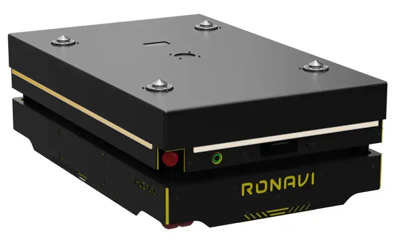
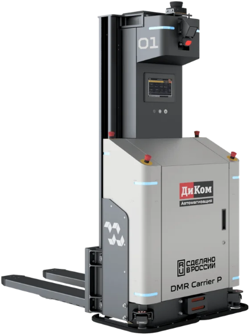
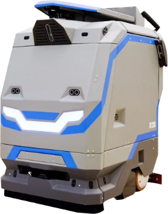
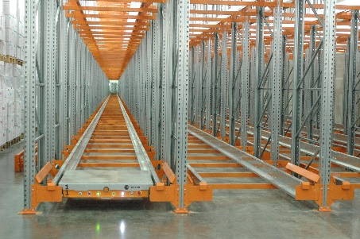
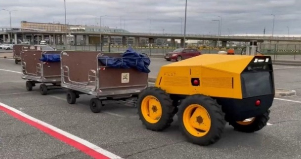
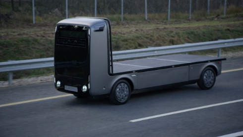
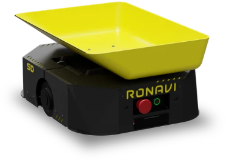
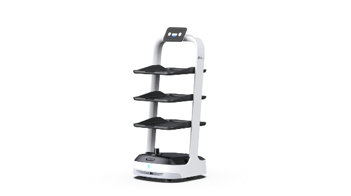

# Примеры решений в отраслях

> Агентская версия исходного документа
> [`05-primery-resheniy-v-otraslyah.docx`](05-primery-resheniy-v-otraslyah.docx).
> Текст, таблицы, ссылки и изображения перенесены без изменения исходного
> смысла. При расхождениях контролирующим источником остается DOCX.

В данном документе представлены примеры решений для каждого направления.
Технические данные (ТТХ) каждого робота представлены на примере
конкретного решения, в случае нахождения другой модели, технические
данные (ТТХ) могут отличаться. Можно использовать другие модели с иными
ТТХ.

## Примеры решений в роботизации склада

<table>
<colgroup>
<col style="width: 49%" />
<col style="width: 50%" />
</colgroup>
<thead>
<tr>
<th style="text-align: center;"></th>
<th style="text-align: center;"></th>
</tr>
</thead>
<tbody>
<tr>
<td style="text-align: center;">
AMR (автономный мобильный робот) (на
примере модели Ronavi H1500)

ТТХ:

<ul>
<li>
Грузоподъёмность: до 1500 кг.
</li>
<li>
Масса робота: 250 кг.
</li>
<li>
Габариты (ДхШхВ): 1044 × 654 × 380 мм.
</li>
<li>
Максимальная скорость: до 1,5 м/с.
</li>
<li>
Тип навигации: QR-метки и SLAM (карта помещения).
</li>
<li>
Время зарядки: около 18 минут на станции.
</li>
<li>
Время работы: до 6 часов.
</li>
<li>
Производительность: до 80–100 паллет/час (при типовой
конфигурации зоны).
</li>
<li>
Точность позиционирования: около ±3 мм.
</li>
<li>
Допустимые условия эксплуатации: работа при температуре примерно
+5…+25 °C, ровный промышленный пол.
</li>
</ul></td>
<td>
FMR (мобильный вилочный робот) (на примере DMR Carrier P)

ТТХ:

<ul>
<li>
Грузоподъемность: 1500 кг
</li>
<li>
Высота подъема вил (для EUR-паллет): до 1600 мм
</li>
<li>
Максимальная скорость движения: 1,5 м/с
</li>
<li>
Время автономной работы: до 10 часов
</li>
<li>
Тип навигации: SLAM на базе лидаров (без магнитных лент и
QR-меток)
</li>
<li>
Масса робота: около 2000–2500 кг.
</li>
<li>
Габариты (В×Ш×Г): примерно 2050 × 1975 × 1000 мм.
</li>
<li>
Производительность: до 40–60 паллет/час (типичный
проект).
</li>
<li>
Допустимые условия эксплуатации: стандартный склад и
производственный цех с ровным бетонным покрытием.
</li>
</ul></td>
</tr>
<tr>
<td style="text-align: center;"></td>
<td style="text-align: center;"></td>
</tr>
<tr>
<td style="text-align: center;">
Робот-уборщик помещений (на примере
модели MARK 2 SE)

ТТХ:

<ul>
<li>
Бак для моющего раствора: 40 литров.
</li>
<li>
Ширина захвата (уборки): от 43 до 60 см.
</li>
<li>
Время работы: до 3 часов на одном заряде (в некоторых режимах до
4 часов со станцией).
</li>
<li>
Время зарядки: около 2 часов.
</li>
<li>
Эффективность уборки: до 1000 м2/ч.
</li>
<li>
Габариты (Д×Ш×В): около 860 × 610 × 980 мм.
</li>
<li>
Масса робота: порядка 130–200 кг.
</li>
<li>
Скорость движения: до 3–4 км/ч.
</li>
<li>
Тип навигации: лидар + камеры (автоматическое построение
маршрутов и карты помещения).
</li>
</ul></td>
<td>
Шаттл система (на примере Pallet shuttle от Stelcon)

ТТХ:

<ul>
<li>
Высота складов: До 12–15 метров
</li>
<li>
Грузоподъемность: До 1500 кг
</li>
<li>
Скорость перемещения (с грузом / без груза): До 0,75–1,0
м/с.
</li>
<li>
Автономность работы: Аккумуляторные батареи (АКБ) обеспечивают
полноценную работу от одной зарядки в течение рабочей смены (в среднем
8–10+ часов).
</li>
<li>
Габариты шаттла: под размер паллеты, ориентировочно 1200 × 800 ×
200 мм.
</li>
<li>
Производительность: до 80–120 паллет/час на канал.
</li>
<li>
Допустимые условия эксплуатации: работа в канальных стеллажах,
возможны исполнения для холодильных и морозильных складов.
</li>
</ul></td>
</tr>
</tbody>
</table>

## Примеры решений в роботизации аэропорта

<table>
<colgroup>
<col style="width: 49%" />
<col style="width: 50%" />
</colgroup>
<thead>
<tr>
<th style="text-align: center;"></th>
<th style="text-align: center;"></th>
</tr>
</thead>
<tbody>
<tr>
<td style="text-align: center;">
AMR (автономный мобильный робот) (на
примере модели Ronavi H1500)

ТТХ:

<ul>
<li>
Грузоподъёмность: до 1500 кг.
</li>
<li>
Масса робота: 250 кг.
</li>
<li>
Габариты (ДхШхВ): 1044 × 654 × 380 мм.
</li>
<li>
Максимальная скорость: до 1,5 м/с.
</li>
<li>
Тип навигации: QR-метки и SLAM (карта помещения).
</li>
<li>
Время зарядки: около 18 минут на станции.
</li>
<li>
Время работы: до 6 часов.
</li>
<li>
Производительность: до 80–100 паллет/час (при типовой
конфигурации зоны).
</li>
<li>
Точность позиционирования: около ±3 мм.
</li>
<li>
Допустимые условия эксплуатации: работа при температуре примерно
+5…+25 °C, ровный промышленный пол.
</li>
</ul></td>
<td>
FMR (мобильный вилочный робот) (на примере DMR Carrier P)

ТТХ:

<ul>
<li>
Грузоподъемность: 1500 кг
</li>
<li>
Высота подъема вил (для EUR-паллет): до 1600 мм
</li>
<li>
Максимальная скорость движения: 1,5 м/с
</li>
<li>
Время автономной работы: до 10 часов
</li>
<li>
Тип навигации: SLAM на базе лидаров (без магнитных лент и
QR-меток)
</li>
<li>
Масса робота: около 2000–2500 кг.
</li>
<li>
Габариты (В×Ш×Г): примерно 2050 × 1975 × 1000 мм.
</li>
<li>
Производительность: до 40–60 паллет/час (типичный
проект).
</li>
<li>
Допустимые условия эксплуатации: стандартный склад и
производственный цех с ровным бетонным покрытием.
</li>
</ul></td>
</tr>
<tr>
<td style="text-align: center;"></td>
<td style="text-align: center;"></td>
</tr>
<tr>
<td style="text-align: center;">
Робот-уборщик помещений (на примере
модели MARK 2 SE)

ТТХ:

<ul>
<li>
Бак для моющего раствора: 40 литров.
</li>
<li>
Ширина захвата (уборки): от 43 до 60 см.
</li>
<li>
Время работы: до 3 часов на одном заряде (в некоторых режимах до
4 часов со станцией).
</li>
<li>
Время зарядки: около 2 часов.
</li>
<li>
Эффективность уборки: до 1000 м2/ч.
</li>
<li>
Габариты (Д×Ш×В): около 860 × 610 × 980 мм.
</li>
<li>
Масса робота: порядка 130–200 кг.
</li>
<li>
Скорость движения: до 3–4 км/ч.
</li>
<li>
Тип навигации: лидар + камеры (автоматическое построение
маршрутов и карты помещения).
</li>
</ul></td>
<td>
Беспилотный тягач (на примере модели Cognitive Pilot)

ТТХ:

<ul>
<li>
Грузоподъемность: до 3 000 кг.
</li>
<li>
Мощность: Номинальная от 30 л.с. до максимальной 50 л.с.
</li>
<li>
Автономность: До 24 часов работы без дозаправки /
подзарядки
</li>
<li>
Топливный бак: 70 литров (для гибридной версии)
</li>
<li>
Скорость движения: Рабочая — от 5 до 20–25 км/ч
</li>
<li>
Габариты (Д×Ш×В): ориентировочно 2300 × 1400 × 1500 мм
(компактный багажный тягач).
</li>
<li>
Масса машины: около 1000–1500 кг.
</li>
<li>
Тип навигации: мультисенсорный автопилот (камеры, лидары, радары,
нейросети).
</li>
<li>
Допустимые условия эксплуатации: круглогодичная работа на перроне
и в багажных зонах, в дождь, снег и туман.
</li>
</ul></td>
</tr>
<tr>
<td style="text-align: center;"></td>
<td style="text-align: left;">
Беспилотный грузовик (на примере модели
EVOCARGO N1)

ТТХ:

<ul>
<li>
Грузоподъёмность: до 2 тонн.
</li>
<li>
Вместимость: до 6 европаллет.
</li>
<li>
Запас хода: 150–200 км на одном заряде.
</li>
<li>
Время зарядки: от 30 минут от быстрой зарядки
</li>
<li>
Объем аккумуляторной батареи: 36 кВт·ч
</li>
<li>
Габариты (Д×Ш×В): примерно 5000 × 1800 × 2200 мм.
</li>
<li>
Скорость движения: до 20–25 км/ч на территории объекта.
</li>
<li>
Тип навигации: автономный автопилот с камерами, лидарами и
сенсорами (уровень автоматизации 4–5).
</li>
</ul>

Допустимые условия эксплуатации: работа 24/7 при температуре примерно
−40…+50 °C.
</td>
</tr>
</tbody>
</table>

## Примеры решений роботизации медицинского учреждения

<table>
<colgroup>
<col style="width: 49%" />
<col style="width: 50%" />
</colgroup>
<thead>
<tr>
<th style="text-align: center;"></th>
<th style="text-align: center;"></th>
</tr>
</thead>
<tbody>
<tr>
<td style="text-align: center;">
AMR (автономный мобильный робот) (на
примере модели Ronavi SD)

ТТХ:

<ul>
<li>
Грузоподъёмность: до 10 кг.
</li>
<li>
Масса робота: 20 кг.
</li>
<li>
Габариты (ДхШхВ): 420x400x200 мм.
</li>
<li>
Максимальная скорость: до 2,5 м/с.
</li>
<li>
Тип навигации: QR-метки.
</li>
<li>
Время работы: до 10 часов.
</li>
<li>
Минимальная ширина проезда: около 700 мм.
</li>
<li>
Точность позиционирования: порядка ±3 мм.
</li>
</ul></td>
<td>
Робот-доставщик (на примере PuduBot 2)

ТТХ:

<ul>
<li>
Габариты: 580*535*1290мм
</li>
<li>
Вес: 39кг
</li>
<li>
Грузоподъемность: 10кг на полку
</li>
<li>
Время зарядки/работы: 4 часа/12 часов
</li>
<li>
Ширина проезда: 80см
</li>
<li>
Скорость: 0.5~1.2м/с（регулируется）
</li>
<li>
Тип навигации: VSLAM + лазерный SLAM (камера + лидар, 3D‑датчики
глубины).
</li>
</ul></td>
</tr>
<tr>
<td style="text-align: center;"></td>
<td></td>
</tr>
<tr>
<td style="text-align: center;">
Робот-уборщик помещений (на примере
модели MARK 2 SE)

ТТХ:

<ul>
<li>
Бак для моющего раствора: 40 литров.
</li>
<li>
Ширина захвата (уборки): от 43 до 60 см.
</li>
<li>
Время работы: до 3 часов на одном заряде (в некоторых режимах до
4 часов со станцией).
</li>
<li>
Время зарядки: около 2 часов.
</li>
<li>
Эффективность уборки: до 1000 м2/ч.
</li>
<li>
Габариты (Д×Ш×В): около 860 × 610 × 980 мм.
</li>
<li>
Масса робота: порядка 130–200 кг.
</li>
<li>
Скорость движения: до 3–4 км/ч.
</li>
<li>
Тип навигации: лидар + камеры (автоматическое построение
маршрутов и карты помещения).
</li>
</ul></td>
<td></td>
</tr>
</tbody>
</table>

## Примечание по выбору решений и источникам информации

Приведённые в данном документе решения (AMR, FMR, роботы‑уборщики,
шаттл‑системы, беспилотные тягачи и грузовики, роботы‑доставщики)
являются типовыми примерами для иллюстрации подхода к роботизации
склада, аэропорта и медицинского учреждения. Участники хакатона могут
выбирать другие модели и производителей, при условии соблюдения
обязательных технических характеристик из ТЗ и документирования
источников данных по каждому выбранному решению.

## Рекомендуемые примеры источников информации о роботизированных решениях

Для поиска и уточнения технических характеристик (ТТХ), сценариев
применения и экономических параметров роботизированных решений
участникам хакатона рекомендуется использовать следующие ресурсы:

### Производители складских мобильных роботов

AMR, сортировка, внутрискладская логистика.

1.  Ronavi Robotics — официальный сайт компании\
    <https://ronavi-robotics.ru/about>

2.  Ronavi Robotics — каталог логистических роботов (все модели)\
    <https://ronavi-robotics.ru/catalogue>

3.  Ronavi H1500 — страница транспортного AMR‑робота\
    <https://ronavi-robotics.ru/catalogue/h1500>

4.  Ronavi SD — сортировочный робот с откидной крышкой\
    <https://ronavi-robotics.ru/catalogue/sd>

5.  Ronavi SR — сортировочный робот для грузов до 50 кг\
    <https://ronavi-robotics.ru/catalogue/sr>

6.  Moros — официальный сайт производителя мобильных роботов\
    <https://xn--l1aeahg.xn--p1ai/>

7.  AMR100 Moros — страница мобильного робота AMR100\
    <https://xn--l1aeahg.xn--p1ai/amr-100/>

8.  RoboB2B — отраслевой маркетплейс робототехники (складские, сервисные
    и др.)\
    <https://robob2b.ru/catalog/>

### FMR-роботы, беспилотные погрузчики и тягачи

9.  ДиКом‑Сервис / DMR Carrier P — автономный вилочный погрузчик\
    <https://tnvst.ru/catalog/fmr-roboty/avtonomnyy-mobilnyy-robot-dikom-dmr-carrier-p/>

10. RoboCV — решения по роботизации складской техники (робот‑штабелёр,
    беспилотный погрузчик, тягач)\
    <https://robocv.ru/>

11. Cognitive Pilot (русский сайт) — системы ИИ для беспилотного
    транспорта (в т.ч. аэропорты, тягачи)\
    <https://cognitivepilot.com/>

12. Cognitive Pilot (англоязычный сайт) — автономные решения для
    наземного транспорта\
    <https://en.cognitivepilot.com/>

### Беспилотные грузовики и автономная логистика

13. Evocargo — официальный сайт разработчика беспилотных
    электрогрузовиков\
    <https://evocargo.com/>

14. Evocargo / N1 — описание решений и кейсов (через корпоративный
    профиль и материалы)\
    <https://robotrends.ru/robopedia/evocargo>\
    <https://www.ixbt.com/news/2024/03/29/v-rossii-predstavili-avtonomnyj-jelektricheskij-gruzovik-evocargo-n1-otechestvennoj-razrabotki.html>

### Роботы-уборщики и сервисные роботы

15. MARK 2 SE — официальный сайт робота‑уборщика R2B\
    <https://r2b.company/mark2se>

16. Промышленный робот‑уборщик MARK 2 SE — описание и характеристики\
    <https://www.kiit.ru/product/promyshlennyy-robot-uborshchik-mark-2-se/>

17. Pudu Robotics — страница сервиса‑робота PuduBot 2\
    <https://www.pudurobotics.com/en/products/pudubot2>

### Роботизированные системы хранения

AS/RS, кубическое хранение, шаттлы.

18. ARS Smart Robotics / SmartCube — роботизированная система
    кубического хранения\
    <https://arobosys.ru/> (SmartCube™)

19. SmartCube — описание системы кубического хранения (аналитика и
    кейсы)\
    <https://gazprombank.investments/blog/reviews/ars-smart-robotics/>

20. Pallet Shuttle (Stelkon) — система глубокого хранения паллет\
    <https://www.stelkon.ru/catalog/palletnye-stellazhi/pallet/>
