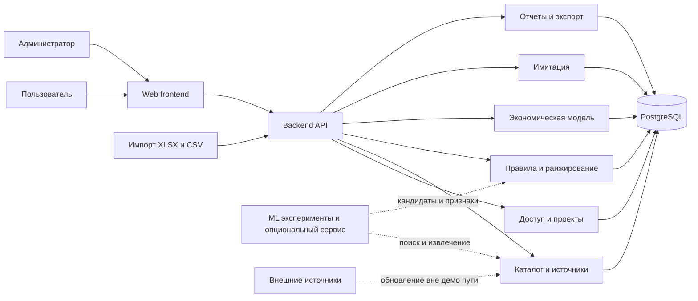

# Концепция решения и монорепозитория

## 1. Архитектурный тезис

Для хакатона целесообразен модульный монолит с четкими доменными границами, а не набор микросервисов. Это даст один управляемый backend, одну транзакционную базу, воспроизводимый запуск и меньше интеграционных рисков. Экономика, рекомендации и имитация остаются отдельными модулями и при необходимости смогут быть вынесены в сервисы позже.

Backend фиксируется как модульный монолит на Go. ML следует держать в отдельной Python-зоне монорепозитория и развивать параллельно, но не делать обязательной зависимостью основного пользовательского пути до появления подходящих данных и доказанной задачи.

## 2. Логическая схема



Пунктирные связи не входят в обязательный критический путь MVP.

## 3. Основные модули backend

### 3.1. Identity and access

- зарегистрированные пользователи и изолированные гостевые сессии;
- аутентификация или выдача гостевого session principal;
- обязательная серверная авторизация на уровне проекта;
- проверка владельца проекта при чтении, изменении, расчете, экспорте и удалении;
- удаление проекта и файлов;
- аудит административных изменений.

Frontend не является границей безопасности. Каждый проект принадлежит конкретному principal, а Go-backend проверяет это отношение на каждом проектном endpoint. Регистрация и расширенные роли могут появиться позже, но API-авторизация и тесты межпроектной изоляции являются условием развертывания demo/staging.

### 3.2. Project configuration

- тип объекта и версия схемы;
- значения параметров;
- валидация;
- импорт;
- сценарии и допущения;
- снимок версий зависимых данных.

### 3.3. Catalog and provenance

- продукты и варианты;
- категории и сценарии применения;
- технические характеристики;
- предложения и цены;
- реализованные кейсы;
- источники, даты и подтвержденность;
- публикация версий каталога.

### 3.4. Recommendation engine

- выбор кандидатов по типу объекта и процессу;
- жесткие ограничения;
- обработка отсутствующих данных;
- балльная оценка;
- объяснения;
- ручное добавление решения;
- версия правил.

### 3.5. Economics engine

- расчет состава оборудования;
- сценарий без роботизации;
- покупка;
- RaaS;
- CAPEX, OPEX, эффект, окупаемость, ROI и TCO;
- чувствительность;
- ручные корректировки и история.

### 3.6. Simulation engine

- схема зон и маршрутов;
- генерация потока операций;
- ресурсы роботов и зарядных станций;
- очереди и обслуживание;
- результаты и трасса для анимации;
- воспроизводимость по seed и версии модели.

### 3.7. Reporting

- итоговое представление сравнения;
- снимок исходных данных;
- экспорт PDF;
- экспорт табличных результатов;
- снимок визуализации;
- предупреждение о предварительном характере оценки.

## 4. Алгоритм подбора

### 4.1. Этап 1. Формирование кандидатов

Каталог фильтруется по типу объекта, процессу, типу операции и статусу доступности. Это сокращает набор, но еще не подтверждает техническую применимость.

### 4.2. Этап 2. Жесткие ограничения

Для склада первыми правилами могут быть:

- грузоподъемность робота не ниже массы перемещаемой единицы;
- габариты и безопасные зазоры укладываются в ширину прохода;
- допустимый тип и ровность пола;
- рабочая температура соответствует зоне;
- хватает зарядной мощности;
- решение поддерживает нужный тип груза и операции;
- инфраструктурная интеграция обязательна и доступна либо явно требует доработки;
- производительность достижима при допустимом количестве оборудования.

Результат каждого правила содержит статус, входные значения, источник, объяснение и критичность.

### 4.3. Этап 3. Работа с неизвестностью

Отсутствующее значение нельзя автоматически считать прошедшим проверку. Для него задается одно из поведений:

- блокировать рекомендацию, если параметр критический;
- разрешить только со статусом `needs_review`;
- применить документированное допущение и показать его влияние.

Канонический enum результата един для API, базы, правил и UI:

- `applicable` — ограничения пройдены на подтвержденных данных;
- `applicable_with_assumptions` — ограничения пройдены с сохраненными допущениями;
- `needs_review` — данных недостаточно для вывода;
- `not_applicable` — нарушено жесткое ограничение.

После дополнения данных `needs_review` пересчитывается в один из остальных статусов. Принятие явного допущения может привести к `applicable_with_assumptions`, но не к `applicable`.

### 4.4. Этап 4. Ранжирование

После жесткого отсева рассчитывается объяснимый балл. Возможные группы критериев:

- техническое соответствие;
- достаточность производительности;
- инфраструктурная готовность;
- зрелость и наличие кейсов;
- качество данных;
- соответствие бюджету;
- экономика сценария.

Веса должны храниться как версионируемая конфигурация. Итоговый балл не может отменить провал критического правила.

### 4.5. Этап 5. Объяснение

Карточка результата показывает:

- почему решение попало в список;
- какие правила пройдены;
- какие ограничения сработали;
- какие сведения отсутствуют;
- какие допущения применены;
- какие факторы дали основной вклад в балл;
- какие источники использованы.

## 5. Экономическая модель

### 5.1. Принцип

Расчет должен быть набором чистых детерминированных функций. Входные данные и версия формул сохраняются. UI не рассчитывает финансовые показатели самостоятельно, а только отображает результат backend.

### 5.2. Минимальные зависимости

- Количество роботов = округленная вверх пиковая потребность / эффективная производительность одного робота.
- Эффективная производительность учитывает коэффициент загрузки, доступность и резерв.
- CAPEX = оборудование + инфраструктура + ПО + интеграция + пусконаладка + обучение + резерв.
- OPEX = сервис + лицензии + энергия + связь + расходники + ремонт + эксплуатационный персонал.
- Годовой эффект = снижение текущих затрат + дополнительный доход или предотвращенные потери - дополнительный OPEX.
- Простой срок окупаемости = CAPEX / положительный годовой эффект.
- ROI = накопленный эффект за горизонт / CAPEX x 100% только при `CAPEX > 0`.
- TCO = CAPEX + OPEX за горизонт + замена основных компонентов.

Правила округления, периодизация, НДС, амортизация и трактовка остаточной стоимости должны быть отдельными явными параметрами модели.

Если `CAPEX = 0`, ROI математически не определен. Расчетный контракт возвращает для метрики `value: null`, `availability: not_applicable` и `reason_code: no_initial_investment`; UI и экспорт отображают «N/A — нет начальных вложений». Поле `availability` относится к доступности финансовой метрики и не является enum статуса рекомендации. Значение нельзя заменять нулем, бесконечностью или ошибкой вычисления. Для такого сценария сравниваются годовой чистый эффект, TCO и накопленный эффект за горизонт. Отдельная метрика эффективности расходов RaaS может быть добавлена только с собственным названием и формулой.

### 5.3. Сценарии

| Сценарий | CAPEX | OPEX | Особенность |
| --- | ---: | ---: | --- |
| Текущий процесс | Обычно нет нового CAPEX | Персонал и текущая эксплуатация | База сравнения; ROI — `N/A`, если CAPEX равен нулю |
| Покупка | Оборудование и внедрение | Сервис, лицензии, энергия, персонал | Возможна амортизация |
| RaaS | Минимальный или ограниченный | Платежи и эксплуатация | Нужна явная структура договора; при нулевом CAPEX ROI и payback — `N/A` |

### 5.4. Чувствительность

Минимальный набор для склада:

- цена оборудования;
- объем операций;
- стоимость труда.

Полезно добавить коэффициент загрузки и стоимость обслуживания. Результат лучше показывать диапазоном или небольшой матрицей, а не единственным «точным» числом.

## 6. Имитация

### 6.1. Рекомендуемый уровень модели

Для складского MVP достаточно дискретно-событийной модели на схеме зон и маршрутов. Полноценная физика и 3D не требуются.

Сущности модели:

- зоны отправления и назначения;
- граф маршрутов;
- задания;
- роботы;
- точки загрузки и разгрузки;
- зарядные станции;
- очереди;
- календарь смен и перерывов.

### 6.2. Связь с экономикой

Имитация должна вернуть фактическую расчетную производительность сценария. Если плановый объем не достигается, экономическая карточка получает риск или требует пересчета количества роботов. Для MVP безопаснее не создавать автоматический цикл между модулями, а явно показывать расхождение и действие «пересчитать состав оборудования».

### 6.3. Frontend-визуализация

Backend возвращает итоговые KPI и временную трассу событий. Frontend воспроизводит трассу на 2D-схеме. Скорость анимации влияет только на отображение и не меняет расчет.

## 7. Рекомендуемый технологический стек

| Область | Предложение | Почему |
| --- | --- | --- |
| Frontend | Next.js, React, TypeScript | Быстрая разработка сложного пользовательского пути и типизированный клиент |
| UI | Tailwind CSS и единый компонентный слой | Скорость и согласованность интерфейса |
| Backend | Go, модульный монолит | Обязательный стек команды; один deployable с явными доменными пакетами |
| HTTP API и валидация | OpenAPI-first, стандартный `net/http` и легковесный router | Контракт отделен от конкретного фреймворка и пригоден для генерации клиента |
| Доступ к данным и миграции | PostgreSQL-драйвер, типизированные SQL-запросы и версионируемые миграции | Явный SQL и воспроизводимое изменение схемы; конкретные библиотеки фиксируются ADR |
| База | PostgreSQL | Транзакции, связи, JSONB для расширяемых метаданных |
| Симуляция | Детерминированный дискретно-событийный модуль на Go | Единый runtime с расчетным ядром и отсутствие обязательного Python-сервиса в MVP |
| ML | Python для подготовки данных, экспериментов, обучения и опционального inference | Независимый жизненный цикл; интеграция только после проверки модели |
| Контракты | OpenAPI и генерация TypeScript-клиента | Уменьшает расхождения frontend и backend |
| Контейнеры | Docker и Docker Compose | Требование ТЗ и воспроизводимость |

Конкретные библиотеки нужно закрепить отдельным техническим решением после проверки лицензий и поддержки выбранных версий.

## 8. Структура монорепозитория

```text
apps/
  frontend/              # Next.js web application
  backend/               # Go modular monolith
ml/
  README.md              # ML-задача, источники, метрики и критерии допуска модели
  notebooks/             # исследовательские эксперименты без production-логики
  src/                   # подготовка данных, обучение и опциональный inference
  tests/
packages/
  api-client/            # сгенерированный TypeScript-клиент
  ui/                    # общие компоненты интерфейса
  config/                # общие frontend-настройки линтинга и TypeScript
data/
  raw/                   # неизменяемые исходные снимки с версиями
  prepared/              # нормализованные демонстрационные данные
  schemas/               # схемы импорта и справочники единиц
infra/
  docker/
  deploy/
docs/
  product-discovery/
  architecture/
  operations/
openspec/
  specs/
  changes/
.github/
  workflows/
```

Исходные конкурсные файлы уже находятся в `artifacts/`. Переносить или переписывать их не нужно. Позже можно решить, считать ли `artifacts/` аналогом `data/raw/` или оставить его неизменяемым архивом, а подготовленные данные разместить в `data/prepared/`.

## 9. Контракты между частями

### Frontend и backend

- OpenAPI является источником типов API.
- Frontend не дублирует формулы экономики и правила подбора.
- Ошибки имеют стабильный код, человекочитаемое сообщение и привязку к полю.

### Backend и ML

- Go-backend и Python ML-компонент обмениваются данными только через версионированный документированный контракт; для MVP предпочтителен HTTP/JSON.
- Ответ ML считается кандидатом или дополнительным признаком, а не безусловным решением.
- Backend может работать при полном отключении ML.
- Обучение не выполняется внутри backend-процесса.

### Backend и имитация

- Запуск принимает неизменяемый снимок сценария и seed.
- Результат содержит версию модели, KPI, предупреждения и трассу событий.
- Повтор запуска с теми же входами дает совпадающие результаты в пределах зафиксированного правила округления.

## 10. CI и деплой

### 10.1. Pull request

GitHub Actions должны выполнять независимо:

- проверку Markdown и внутренних ссылок;
- frontend lint, typecheck, unit tests и production build;
- backend `gofmt`, статический анализ, unit и integration tests;
- тесты расчетных контрольных примеров;
- тесты качества подготовленных данных;
- проверку согласованности OpenAPI и сгенерированного клиента;
- сборку Docker-образов;
- сканирование секретов и зависимостей, если укладывается в сроки.

### 10.2. Основная ветка

- повтор обязательных проверок;
- сборка версионированных образов;
- публикация в GitHub Container Registry;
- деплой только в выбранное окружение и только из защищенной ветки;
- smoke test после деплоя;
- понятный откат на предыдущий образ.

Конкретный механизм деплоя зависит от выбранной площадки. До ее выбора нельзя надежно спроектировать последний шаг workflow и хранение секретов.

## 11. Наблюдаемость и эксплуатация

Минимально нужны:

- структурированные логи с `request_id`, `project_id` и `simulation_run_id` без чувствительных данных;
- health и readiness endpoints;
- метрики длительности расчета и имитации;
- учет ошибок импорта;
- журнал публикаций каталога и расчетных моделей;
- резервное копирование PostgreSQL для развернутого стенда.

## 12. Почему не микросервисы

Каталог, проект, правила и экономика тесно связаны транзакциями и версионированием. На хакатоне разнос по сетевым сервисам увеличит количество контрактов, окружений и точек отказа без доказанной нагрузки. Модульный монолит сохраняет границы кода и позволяет вынести имитацию или ML позже, когда появятся независимое масштабирование и отдельный жизненный цикл.
